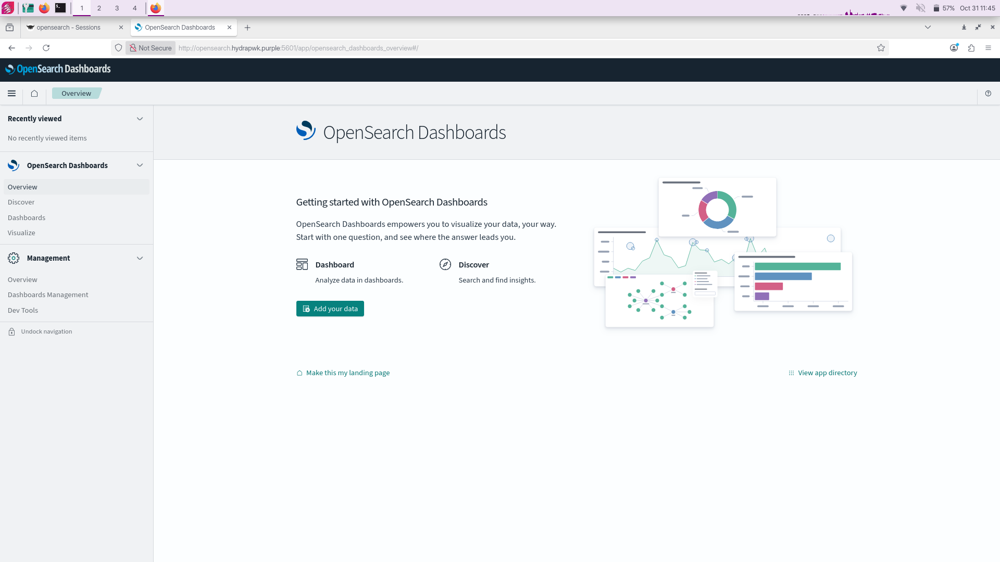
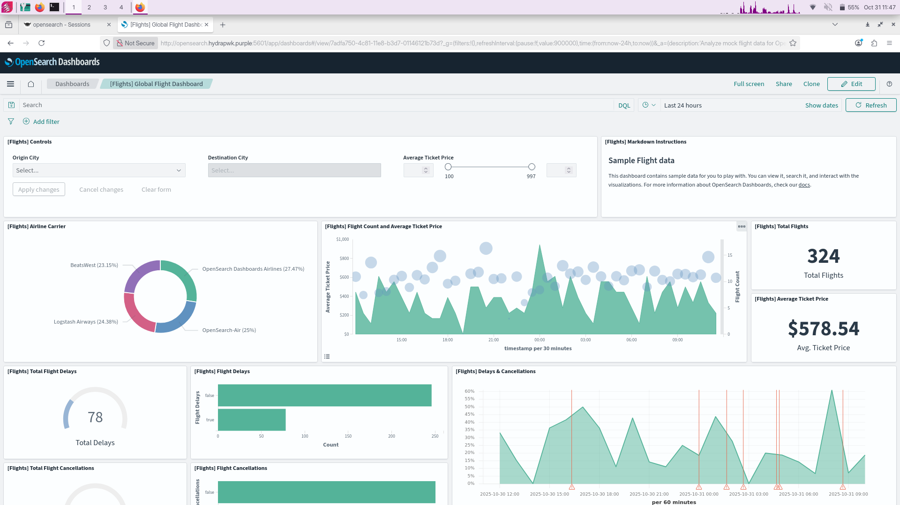

  </img>

# NetHydra

> Formely known as HydraPWK

NetHydra is an Security-auditing focused.

**Tools in NetHydra**

***Arkime***

**OpenSearch Dashboards**

**Wazuh**

_...And Standard Pentesting_

**Team**

[_@me-joe_](https://github.com/me-joe)

**Contributing**

NetHydra is Open-source project anyone free to contribute. [_GitHub_](https://github.com/NetHydra) and [_GitLab_](https://gitlab.com/NetHydra)
