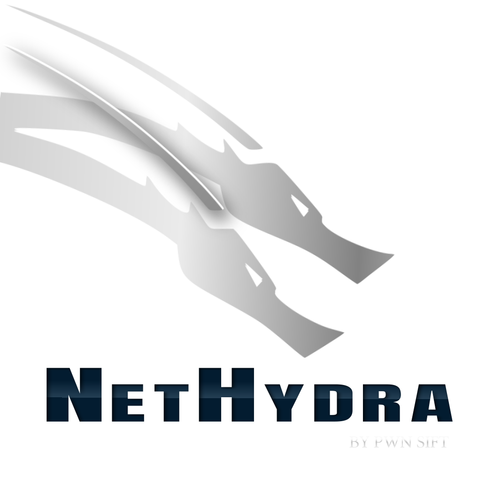

  </img>

# NetHydra

NetHydra formerly known as **HydraPWK** is Linux distribution based on Debian, developed and Maintained under [Pwn Sift](https://github.com/pwnsift) for Security Auditing (Extra SOC)
